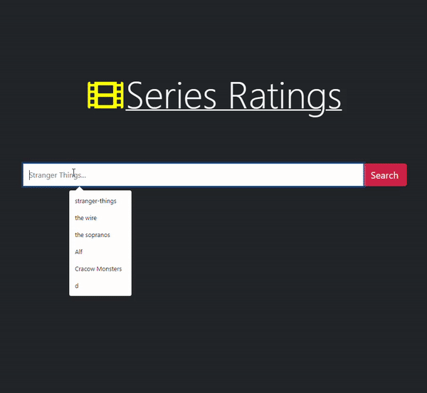

# Series Ratings

A Series Ratings application where you can search for the IMDb & Rotten Tomatoes ratings for your favorite series.

  
  

## Usage

### Requesting a Serie's scores

Write the series of your choosing in the search bar in order to have the application fetch it's IMDb score and Rottentomatoes tomatometer and audience scores.

It shouldn't take more than 6 seconds to load the values the first time. The next time you search for the same series the app will show the score's inmediatly.

## Installation

For installing the Django application clone the repository and run:

     pipenv install

This will install the virtual environments and all dependencies.

Now start the virtual environment shell:

     pipenv shell

Run migrations:
python manage.py makemigrations
python manage.py migrate

Create superuser:

    python manage.py createsuperuser

Now you can start server...

    python manage.py runserver

...and visit http://localhost:8000/

## Installation - React

For installing the React application go to the front-end folder and run:

    npm install

And after install is finished run:

    npm start

## Installation - Cypress

For installing Cypress go to the e2e folder and run:

    npm install

## Tests

| Type | Location                                                               |
| ---- | ---------------------------------------------------------------------- |
| api  | [e2e/cypress/integration/api-tests](e2e/cypress/integration/api-tests) |
| ui   | [e2e/cypress/integration/ui-tests](e2e/cypress/integration/ui-tests)   |
| unit | [media_ratings/tests](media_ratings/tests)                             |

## Running tests

### Unit tests

For running the tests run:

    python manage.py test

### E2E tests

For running the tests go to the e2e folder and run:

    npm run test

For running the tests on headless mode run:

    npm run test:headless

For opening cypress client run:

    npm run test:open

## Uses

- Django.
- DRF.
- React
- React-Bootstrap.
- Font Awesome icons.
- Cypress.

## Features

- Web Parsing.
- UI tests.
- API tests.
- Unit tests.
